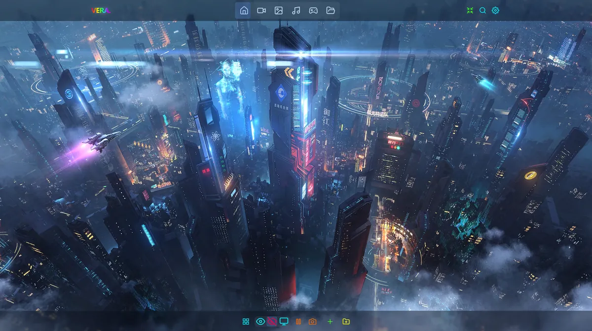
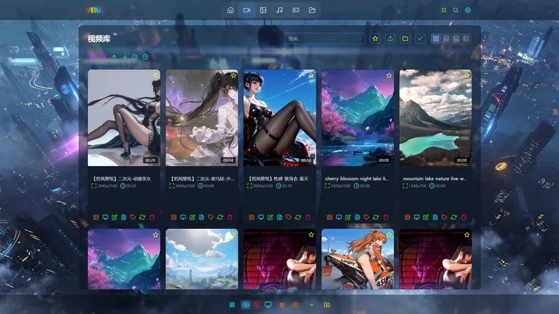
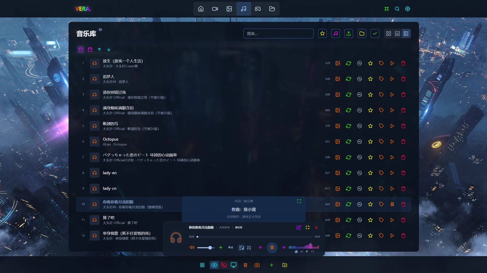
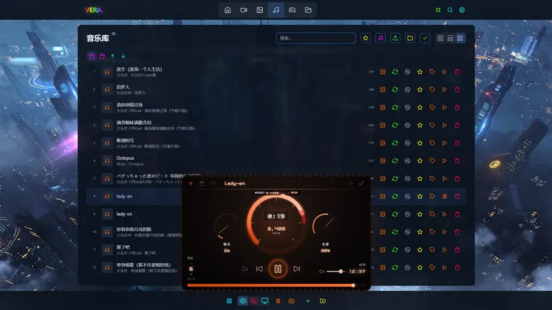
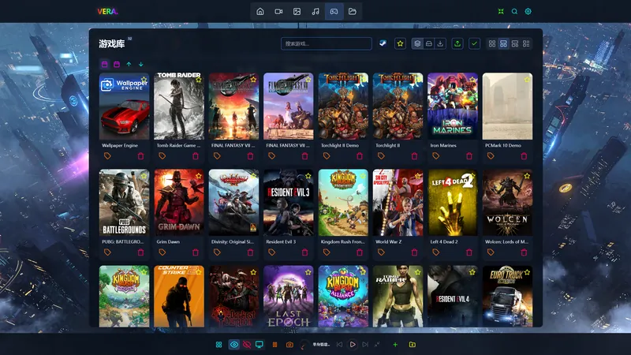
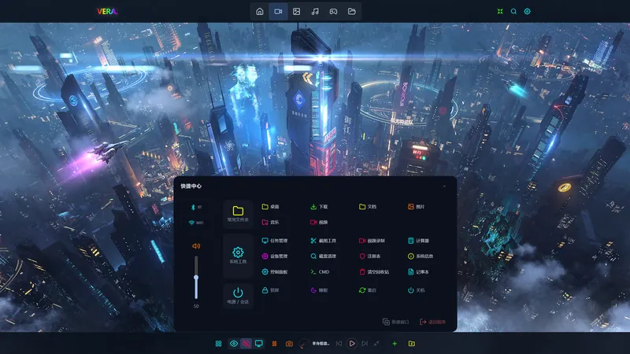
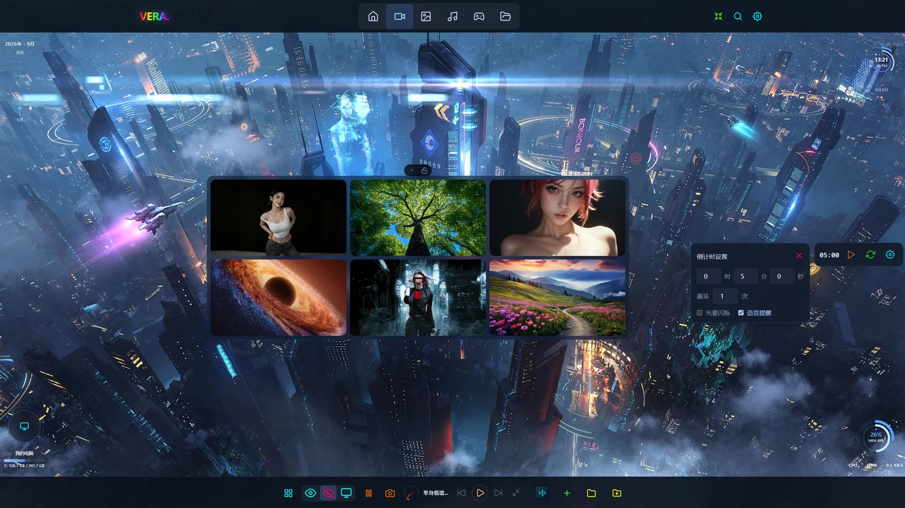
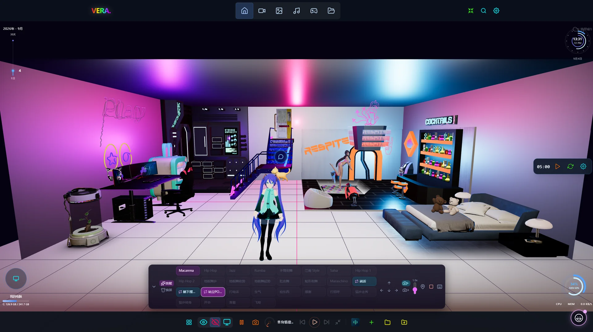
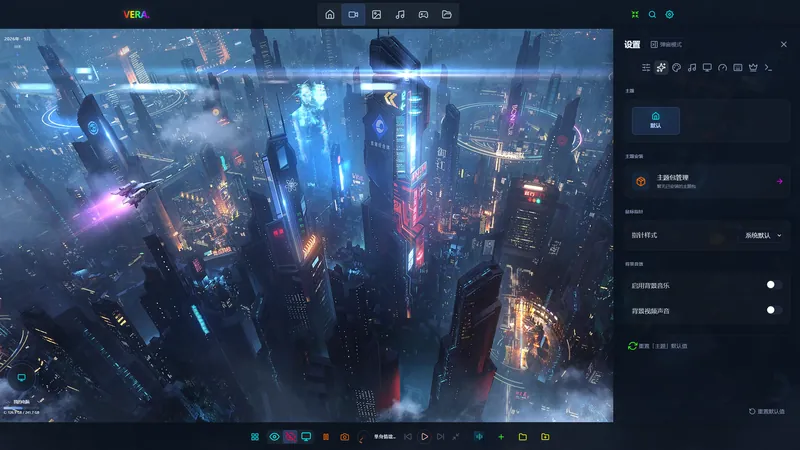

# Vera Media Manager

Windows 桌面娱乐中心——电影 · 音乐 · 图片 · 游戏 · 文件管理一站式接管，配上会讲故事的沉浸式主题系统，把桌面变成你的个人娱乐主机。

[官网](https://scm-think.cn) · [使用文档](https://scm-think.cn/docs) · [下载最新版](#下载) · [Bilibili](https://space.bilibili.com/106858508) · [爱发电](https://ifdian.net/a/cyber2079)

**关注 B 站即可获得永久免费使用权** · 未关注用户享 14 天全功能试用

---

## 为什么是 Vera

- **拒绝千篇一律，桌面由我定义**——个性化沉浸主题 + 外观定制：多套组合字体、调色板、毛玻璃效果，随时整桌换气质
- **一站式娱乐中心**——电影、音乐、图片、游戏、文件管理不换应用；主流格式 GPU 硬解直接播，特殊格式一键分流外接播放器（PotPlayer/VLC/MPV/MPC-HC），NAS 与映射盘开箱即用
- **聪明的媒体库**——拖拽或扫描导入自动去重，元数据与封面自动匹配，跨库全局搜索，热门歌曲 / 影视 / Steam 游戏推荐
- **把效率装进桌面**——时钟、天气、照片、视频等桌面组件自由拼装，QuickHub 快速启动中心 + 快捷启动栏，常用的一切一步直达

## 界面一览

| | |
|---|---|
|  |  |
|  |  |
|  |  |
|  |  |

媒体文件始终保存在你自己的电脑上：本地管理，不转存、不上传。

## 功能概览

| | |
|---|---|
| **影音管理** | 文件夹扫描导入 · 元数据自动匹配 · 断点续播 · GPU 硬件解码(HEVC 自动安装) · 外接播放器(PotPlayer/VLC/MPV/MPC-HC) · NAS 映射盘 · 标签/收藏/搜索 · 随机电影 |
| **音乐与音频** | 后台跨页播放 · 歌单(4 种播放模式) · 逐字歌词 · 10 段均衡器(9 预设) · 实时频谱 · 迷你播放器 · 播放器皮肤 |
| **图片** | 高质量缩略图 · 全屏查看器(缩放/旋转/翻页) · 一键设为桌面壁纸 |
| **游戏** | Steam 库一键扫描 · 封面自动匹配 · steam:// 直启 · 主程序自动定位 |
| **文件管理** | 文件管理器 · 多窗口 · 快捷中心 · 常用目录一键直达 |
| **桌面体验** | 5 种壁纸模式(静态 / 视频 / 轮播 / 天气 / 3D 场景) · 4 种 Shell 外观 · 桌面组件(时钟/日历/天气/照片/视频/系统监控/倒计时等) · 快捷启动栏 · OLED 防烧屏 |
| **主题与个性化** | 沉浸式主题(每主题特效/音效/BGM) · 调色板与字体定制 · 主题市场持续更新 |
| **数据与系统** | 活动热力图 · 签到统计 · 媒体构成分析 · Steam 热销榜 · 数据备份导入导出 · 8 种语言 · 自动更新 |

## 三分钟上手

1. **选择开始方式**——首次启动引导里三选一：免费使用 / 开始 14 天免费试用 / 输入激活码；
2. **导入媒体**——视频/音乐/图片页点「选择文件夹导入」，或直接把文件夹拖进窗口；封面、时长、分辨率后台自动读取；
3. **换一张壁纸**——图片库任意卡片点「设为壁纸」；
4. **认识两个快捷键**——Ctrl+W 打开快捷中心（常用文件夹、系统工具、电源都在这里）；F1 打开快捷键面板，全部可自定义。

## 下载

安装包托管在本仓库 [Releases](https://github.com/cyber2079/vera-media-manager-release/releases)，提供两种安装格式：

| 格式 | 文件 | 说明 | 适合谁 |
|------|------|------|--------|
| **NSIS** (`*.exe`) | `*-setup.exe` | 安装向导式，体积更小，可选安装目录 | 普通用户(推荐) |
| **MSI** (`*.msi`) | `*.msi` | Windows 标准安装包，支持静默安装与企业批量部署 | 命令行用户 / IT 管理 |

- 普通用户：下载 NSIS `.exe`，双击按向导安装
- 静默部署：`msiexec /i Vera.Media.Manager_1.0.0_x64_en-US.msi /qn`

**系统要求**：Windows 10 及以上，64 位。

首次运行若弹出 Windows SmartScreen 提示，点「更多信息 → 仍要运行」——独立开发者未购买代码签名证书时的正常现象。升级直接覆盖安装，媒体库与设置不受影响。

## 视频介绍与支持

- 演示与介绍视频：[Bilibili 主页](https://space.bilibili.com/106858508)（关注 = 永久免费使用权）
- 支持开发者：[爱发电](https://ifdian.net/a/cyber2079)
- 问题与建议：[官网关于页](https://scm-think.cn/about)留言，或应用内「设置 → 反馈与建议」

---

Vera Media Manager 为专有软件，本仓库发布安装包、界面截图与使用说明。完整功能手册见[官网文档](https://scm-think.cn/docs)。
